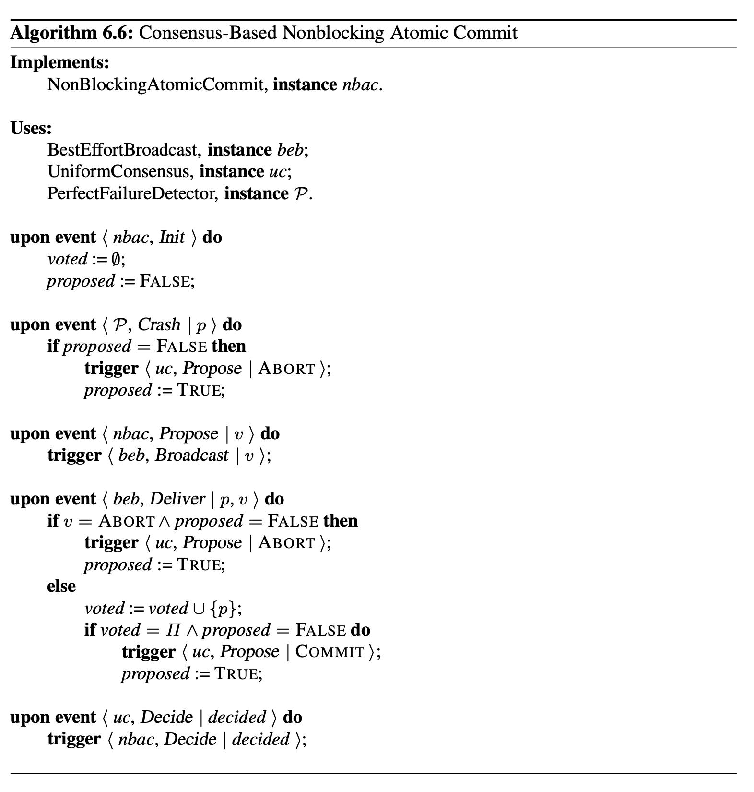

## Consensus-Based Nonblocking Atomic Commit


### Como Executar:
- Será necessário abrir 3 terminais na sua máquina, e rodar o seguinte comando, em cada terminal:
  
    1.`go run chatNBAC.go 127.0.0.1:5001  127.0.0.1:6001 127.0.0.1:7001`
  
    2.`go run chatNBAC.go 127.0.0.1:6001  127.0.0.1:5001 127.0.0.1:7001`
  
    3.`go run chatNBAC.go 127.0.0.1:7001  127.0.0.1:5001 127.0.0.1:6001`

### Casos de Teste:
- Ao rodar os comandos no terminal, será pedido para fazer o *input* de um texto (simulando como se fosse uma query de um banco de dados), em cada um dos terminais.
- Ao enviar o primeiro *input* em qualquer um dos terminais, os outros terminais farão o *output* do que está acontecendo por baixo dos panos (troca de mensagens entre os algoritmos distribuídos)
- Após enviar o primeiro *input*, podemos verificar nos outros terminais qual foi o comportamento do sistema (verificando os logs).
#### Caso ***COMMIT***
- A ideia é simular uma *query* de banco de dados sendo executada em cada um dos nós (terminais). Portanto, devemos passar, em cada terminal, a mesma *query* (*input*).
    - Exemplo no terminal 1:
        ```
        [127.0.0.1:5001 127.0.0.1:6001 127.0.0.1:7001]
        QUERY INPUT: DELETE FROM TABLE
        ```
- Sucessivamente, enviamos a mesma query para os outros terminais e no final **teremos consenso**, e o sistema (todos os nós) decidirão ***COMMIT*** (não houve falhas entre os nós).

#### Caso ***ABORT***
- Como implementamos o **Detector de Falhas Perfeito**, podemos testar o que acontece quando **um dos nós falha**.
    - Lembrando: assumimos um sistema síncrono com tempo máximo entre as mensagens de **10 segundos**.
- Para isso, podemos enviar o mesmo *input* do caso anterior para **dois dos nós (dois terminais)**.
- No terceiro terminal, podemos cancelar o processo (CTRL+C), tendo então, de fato, 2 terminais funcionando.
- Após 10 segundos, o sistema **detectará a falha** do terminal 3 e **entrará em consenso** para o ***ABORT***, pois o sistema é **ATÔMICO**.
